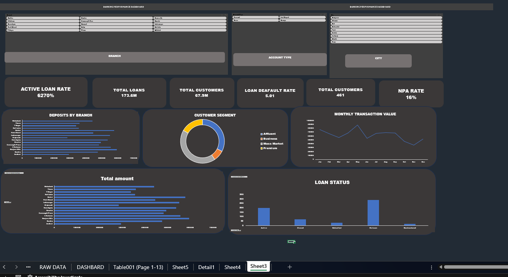

# 🏦 Banking Performance Dashboard

An interactive Banking Performance Dashboard built in Microsoft Excel to analyze customer, deposit, loan, NPA, and transaction performance.

## 📊 Dashboard Preview

## 📌 Key Performance Indicators

- Total Customers
- Total Deposits
- Total Loans
- Active Loan Rate
- Loan Default Rate
- NPA Rate

## 📈 Dashboard Visualizations

- Deposits by Branch
- Loans by Branch
- Monthly Transaction Value
- Loan Status
- Customer Segment Distribution

## 🎛️ Interactive Filters

- City
- Branch
- Account Type

## 🛠️ Tools & Techniques

- Microsoft Excel
- PivotTables
- PivotCharts
- Slicers
- Excel Formulas
- KPI Analysis
- Data Visualization
- Dashboard Design

## 🎯 Project Objective

The objective of this project is to transform banking data into an interactive dashboard that provides a clear view of customers, deposits, loans, transaction activity, loan status, and NPA performance.

## 📂 Dataset

This project uses a synthetic banking dataset created for learning and portfolio purposes.

## 💡 Skills Demonstrated

- Data Cleaning
- Data Analysis
- Excel Dashboard Development
- Business KPI Development
- PivotTable & PivotChart Analysis
- Interactive Reporting
- Data Visualization

## 📁 Project Files

- `Banking_Performance_Dashboard.xlsx` — Excel dashboard and analysis
- `dashboard.png` — Dashboard preview
- `README.md` — Project documentation
